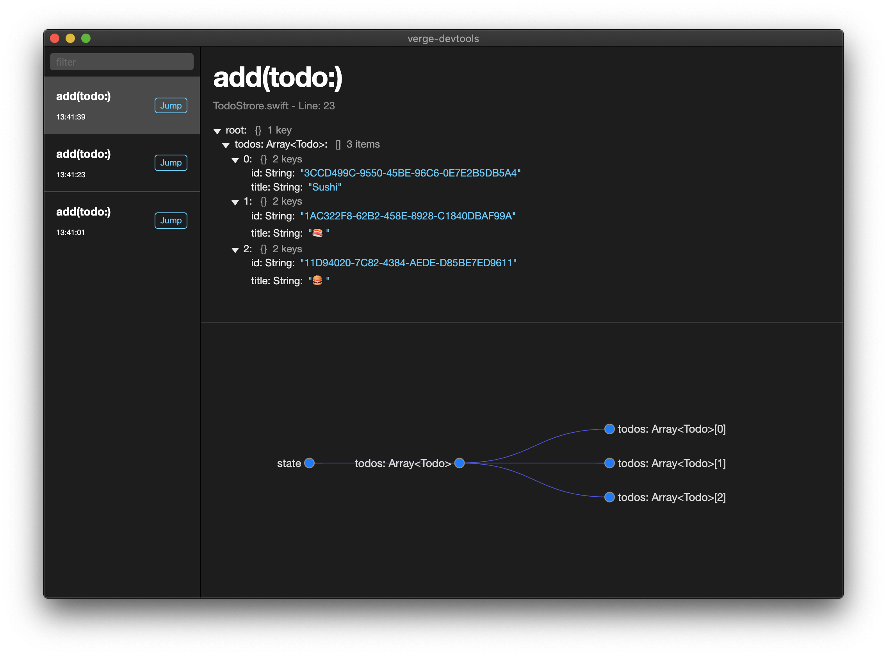

_This project is experimental_

VergeDevtools is a debugging tool for [Verge](https://github.com/VergeGroup/Verge).  
The main features are mostly inspired by redux-devtools.

<p align="center">
  
</p>

# Features

- Time travel
- JSON visualizer
  - Tree Viewer
  - Tree Visualizer
- List View
  - Filtering by Action Name

# Usage

Inject `DevLogger` as logger to Verge store.  
DevLogger will automatically send logs to devtools, hooked by Verge actions.

```
let store: TodoStore = .init(
        initialState: .init(todos: []),
        logger: DevLogger<TodoStore>()
    )
```

# Installation

Download application from the release page and drag and drop to /Applications.
